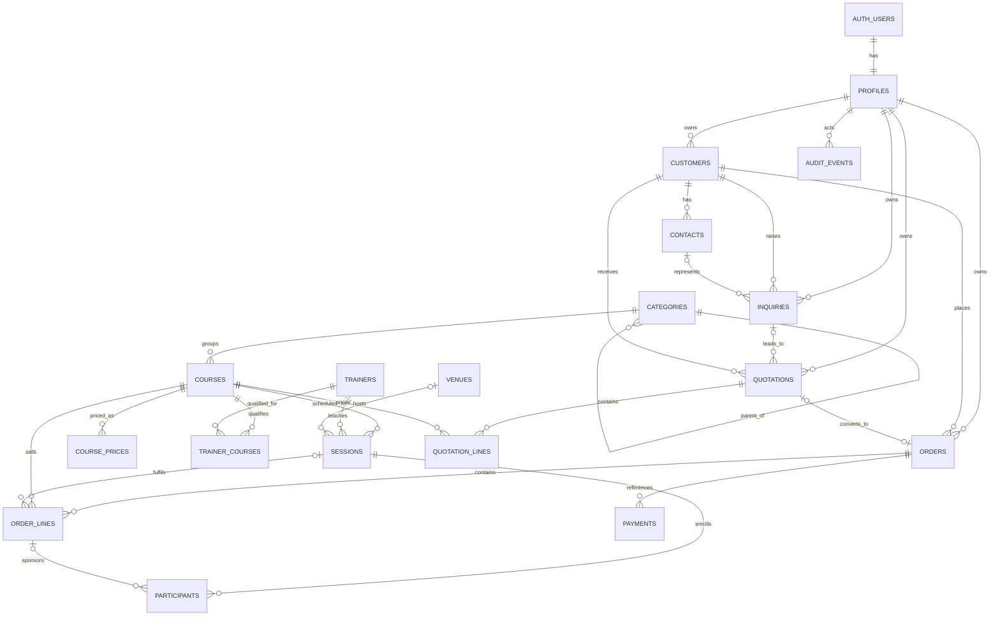

# Clean replacement data model

## 1. Design goals

The proposed model contains **18 public business tables**. It supports the
approved workflow spine without copying the current 52-table schema. Auth users
remain in Supabase's `auth.users` and are not counted. Reporting, UI preference,
task, notification, staging, duplicate-candidate, and derived-state tables are
excluded.

All tables use `uuid` primary keys, `created_at timestamptz`, and where mutable,
`updated_at timestamptz`. Currency uses ISO code plus `numeric(14,2)`, never
floating point. Exact naming may change during implementation review; purposes
and boundaries should not.

## 2. Relationship diagram

## 3. Tables

### 3.1 Identity and governance (2)

#### `profiles`

- **Purpose:** application identity, role, active state, and optional team scope.
- **Required:** `id` (FK `auth.users`), display name, role
  (`administrator|operations|sales|manager|auditor`), `is_active`.
- **Optional:** manager/team identifier, approved capability flags.
- **Lifecycle:** active/deactivated; role change is audited.
- **Ownership:** administrator-managed; a user reads own safe profile fields.
- **RLS:** self read; administrator full; narrowly scoped coworker lookup through
  safe columns/query, never broad profile writes.

#### `audit_events`

- **Purpose:** immutable material business/access change trail.
- **Required:** actor profile, action, entity type/id, occurred time.
- **Optional:** reason, JSON field-level before/after values with sensitive-value
  allowlist rather than indiscriminate row copies.
- **Lifecycle:** append-only; retention policy set operationally.
- **Ownership:** system transaction/actor.
- **RLS:** administrator and auditor read; no direct authenticated writes or
  deletes. Insert only from controlled trigger/functions.

### 3.2 Training catalogue and resources (6)

#### `categories`

- **Purpose:** one category/subcategory hierarchy.
- **Required:** name, `is_active`.
- **Optional:** `parent_id` self-FK, description, display order.
- **Constraints:** parent cannot be self; unique normalized name per parent;
  replacement v1 UI supports at most two levels.
- **Lifecycle/owner:** Operations maintains; deactivate when referenced.
- **RLS:** authenticated read; Operations/Admin write.

#### `courses`

- **Purpose:** stable sellable training definition.
- **Required:** unique code, title, category, duration, default capacity,
  `is_active`.
- **Optional:** description, delivery notes.
- **Constraints:** positive duration/capacity.
- **Lifecycle/owner:** Operations; deactivate, never rewrite historic line data.
- **RLS:** authenticated read; Operations/Admin write.

#### `course_prices`

- **Purpose:** standard price for a course/learning-type/currency combination.
- **Required:** course, learning type (`classroom|virtual|onsite` initially),
  amount, currency, effective-from, active flag.
- **Optional:** effective-to.
- **Constraints:** nonnegative amount; no overlapping active effective ranges for
  the same key.
- **Lifecycle/owner:** Operations/Admin; expire rather than overwrite.
- **RLS:** authenticated read; Operations/Admin write. Cost/margin is not stored.

#### `trainers`

- **Purpose:** trainer scheduling resource.
- **Required:** name, `is_active`.
- **Optional:** email, phone, notes; rate only if explicitly approved and then
  column-restricted from Sales.
- **Lifecycle/owner:** Operations; deactivate.
- **RLS:** Operations/Admin read/write; other roles receive only safe display data
  required for schedules.

#### `trainer_courses`

- **Purpose:** normalized trainer qualification for a course.
- **Required:** trainer, course.
- **Optional:** qualified-until, note.
- **Constraints:** unique trainer/course.
- **Lifecycle/owner:** Operations; remove only if no historic meaning is lost, or
  expire through qualified-until.
- **RLS:** same authority as trainers.

#### `venues`

- **Purpose:** physical or virtual training location resource.
- **Required:** name, type (`physical|virtual`), `is_active`.
- **Optional:** address/joining reference, capacity.
- **Constraints:** physical venue requires positive capacity.
- **Lifecycle/owner:** Operations; deactivate.
- **RLS:** safe read for authenticated scheduling context; Operations/Admin write;
  sensitive cost excluded unless later approved.

### 3.3 Scheduling and fulfilment (2)

#### `sessions`

- **Purpose:** one scheduled delivery of one course.
- **Required:** course, learning type, starts/ends, timezone, capacity, status
  (`draft|confirmed|running|completed|cancelled`), operations owner/creator.
- **Optional:** trainer, venue, online instructions, cancellation/completion facts.
- **Facts:** `confirmed_at/by`, `completed_at/by`, `cancelled_at/by/reason` replace
  separate approval/health state where possible.
- **Constraints:** end after start; positive capacity; completed/cancelled terminal;
  trainer qualified when confirmed; physical venue required/capacity sufficient;
  no confirmed overlapping trainer/venue assignment.
- **Ownership:** Operations.
- **RLS:** all roles read safe schedule fields; Operations/Admin write; terminal
  mutation only through administrator repair or controlled completion/cancel.

#### `participants`

- **Purpose:** session roster and attendance.
- **Required:** session, name, status (`active|removed`), attendance
  (`not_recorded|present|absent`).
- **Optional:** email, order line, phone, removal reason/by/at.
- **Constraints:** unique normalized email among active participants in a session;
  active count not above session capacity; order line, if set, points to same
  session.
- **Lifecycle/owner:** Operations via session; soft-remove, never hard-delete after
  attendance.
- **RLS:** Operations/Admin write; Sales may read only participants sponsored by
  visible own/team order if approved; Manager/Auditor read with PII masking.

### 3.4 Customers and sales (7)

#### `customers`

- **Purpose:** single authoritative customer/company record.
- **Required:** display/legal name, normalized name, sales owner, active flag.
- **Optional:** domain, billing/contact details, external reference.
- **Constraints:** normalized identity indexes; exact duplicate policy pending.
- **Lifecycle/owner:** Sales owner; archive or controlled merge.
- **RLS:** Sales own/team write; Sales shared-search read according to owner decision;
  Operations read fulfilment-needed fields; Manager/Auditor read; Admin repair.

#### `contacts`

- **Purpose:** people belonging to a customer.
- **Required:** customer, name, active flag.
- **Optional:** email, phone, job title, primary flag.
- **Constraints:** contact method required before use on inquiry; at most one
  primary contact per customer if primary behavior is retained.
- **Lifecycle/owner:** inherits customer scope; deactivate.
- **RLS:** follows customer visibility; Sales own/team write; Operations limited
  write only if explicitly required.

#### `inquiries`

- **Purpose:** initial training opportunity and qualification.
- **Required:** customer, owner, subject/interest, status
  (`new|qualified|won|lost`).
- **Optional:** contact, course, estimated participants/value, expected close,
  notes, loss reason.
- **Constraints:** loss reason required for lost; won links forward through quote
  or order where applicable.
- **Lifecycle/owner:** Sales own/team; Admin repair.
- **RLS:** Sales own/team read/write; Operations read only linked accepted work if
  genuinely needed; Manager/Auditor read-only.

#### `quotations`

- **Purpose:** optional customer offer header.
- **Required:** customer, owner, quote number, issued/valid-until, currency, status
  (`draft|sent|accepted|declined|expired`).
- **Optional:** source inquiry, accepted/declined facts and reason.
- **Constraints:** cannot send without lines; accepted/declined terminal except
  audited Admin repair; expiry derived/actioned from date rather than user whim.
- **Lifecycle/owner:** Sales own/team.
- **RLS:** Sales own/team write; Operations read only once linked to handed-off
  order if needed; Manager/Auditor read-only.

#### `quotation_lines`

- **Purpose:** quoted course, delivery type, quantity and commercial snapshot.
- **Required:** quotation, course, description snapshot, learning type, seats,
  unit price, currency.
- **Optional:** notes.
- **Constraints:** positive seats/nonnegative amount; immutable after quote leaves
  draft except controlled revision.
- **Ownership/RLS:** inherits quotation.

#### `orders`

- **Purpose:** commercial commitment, owner, responsibility, and handoff facts.
- **Required:** customer, sales owner, order number, order date, currency, status
  (`draft|ready|fulfilling|completed|cancelled`).
- **Optional:** source inquiry/quote, external/SAP reference; endorsement,
  acceptance, return and cancellation actor/time/reason facts.
- **Derived:** responsibility is Sales until accepted, Operations after accepted;
  returned reason makes Sales responsible; payment balance comes from payments.
- **Constraints:** unique order number; handoff fact consistency; owner/customer/
  active lines required for endorsement; completed/cancelled terminal.
- **Lifecycle/owner:** Sales owns preparation; Operations owns fulfilment after
  acceptance; explicit transactions move responsibility.
- **RLS:** Sales own/team before and after handoff for commercial fields;
  Operations sees handed-off/all operational fields; field restrictions prevent
  cross-function sensitive edits; Manager/Auditor read-only; Admin repair.

#### `order_lines`

- **Purpose:** purchased course/session and immutable price snapshots.
- **Required:** order, course, description snapshot, learning type, seats, unit
  price, currency, status (`active|cancelled`).
- **Optional:** session, source quote line, cancellation reason/facts.
- **Constraints:** positive seats/nonnegative amount; scheduled types require a
  session before endorsement; course matches session; booked active seats respect
  capacity under concurrency control.
- **Ownership/RLS:** inherits order, with Operations allowed to assign/change
  session after handoff under defined rules.

### 3.5 Finance — conditional (1)

#### `payments`

- **Purpose:** minimal append-only payment or receivable reference against order;
  include only if product owner confirms scope.
- **Required:** order, received/reference date, amount, currency, external
  reference, recorded by.
- **Optional:** `reverses_payment_id`, reversal reason.
- **Constraints:** positive original amount; reversal references same order and
  currency; no update/delete; total/payment status derived.
- **Lifecycle/owner:** append-only; Manager capability/Admin performs reversal.
- **RLS:** visible only within order scope and finance-approved roles; direct
  insert restricted; reversal uses privileged transaction.

If finance is excluded, replacement v1 has **17 tables** and stores only a single
external receivable reference on `orders` after product-owner approval.

## 4. Relationship and lifecycle invariants

1. Customer → inquiry → quote → order links are optional in the forward direction
   but never ambiguous; each child has exactly one customer.
2. Quote/order lines snapshot descriptions and prices while retaining course IDs.
3. Order responsibility is computed from handoff timestamps/reason, not duplicated
   in assignments, tasks, and notification records.
4. A session can fulfil multiple order lines; an order can contain multiple lines
   and sessions. A participant may reference the sponsoring line.
5. Archive/deactivate/cancel/remove/reverse preserves referenced history.
6. `updated_at` supports optimistic concurrency for ordinary edits; handoff,
   capacity, conflict, and completion transactions use database locks.

## 5. RLS policy model

| Table group | Administrator | Operations | Sales | Manager | Auditor |
|---|---|---|---|---|---|
| Profiles/access | Manage, audited | Self/safe coworker read | Self/safe coworker read | Self | Safe identity read |
| Catalogue | CRUD | CRUD | Read active | Read | Read |
| Trainers/venues | CRUD | CRUD | Safe schedule display only | Safe read | Safe read |
| Sessions/participants | Repair/full | CRUD in operational lifecycle | Schedule read; scoped participant read only if approved | Read, PII masked | Read, PII masked |
| Customers/contacts | Repair/full | Fulfilment-context read; narrow updates if approved | Own/team CRUD and shared dedupe lookup | Read | Read, PII masked as required |
| Inquiries/quotes/orders | Repair/full | Handoff/order operational context and actions | Own/team commercial CRUD/actions | Read + explicit approval capability only | Read |
| Payments | Repair/reverse | Record if approved | Own/team read only or masked | Read/reverse by capability | Read references, sensitive fields policy-driven |
| Audit | Read | No direct read except own action receipts | No direct read except own action receipts | Summary only | Read/export |

Safe-field projections must not rely on UI masking. Use column grants, dedicated
security-invoker views only when they measurably simplify safe reads, or narrow
non-privileged query functions. RLS tests verify actual PostgREST behavior.

## 6. Privileged RPC budget (maximum 5)

| Function | Why direct CRUD is insufficient | Main checks |
|---|---|---|
| `create_order(...)` | Atomically creates header, lines, source links, and owner | Sales scope; unique number; line/customer validity; quote ownership |
| `endorse_order(order_id)` | Privilege-sensitive multi-step handoff | Lock; Sales scope; completeness; lifecycle; stamp/audit |
| `accept_order(order_id)` | Transfers responsibility atomically | Operations role; pending endorsement; lock; stamp/audit |
| `return_order(order_id, reason)` | Controlled lifecycle regression | Operations role; nonblank reason; lock; stamp/audit |
| `complete_session(session_id)` | Terminal multi-record consistency | Operations role; resource/roster/attendance checks; lock; stamp/audit |

If payment reversal is approved, either replace one budget item by implementing
order creation through an RLS-safe server transaction, or raise the reviewed
budget to six. Do not hide ordinary CRUD in these functions. Conflict lookup and
order completeness preview can be ordinary RLS-safe SQL queries; enforcement is
repeated inside the transaction that matters.

## 7. Indexes

- Every foreign key receives an index unless covered by a leading unique index.
- `categories(parent_id, normalized_name)` unique.
- `courses(code)` unique; `(category_id, is_active, title)` lookup.
- `course_prices(course_id, learning_type, effective_from)`.
- `trainer_courses(trainer_id, course_id)` unique and reverse course index.
- `sessions(starts_at)`, `(trainer_id, starts_at, ends_at)` and
  `(venue_id, starts_at, ends_at)` partial for active statuses; prefer PostgreSQL
  exclusion constraints for confirmed/running overlap.
- `participants(session_id, status)` plus partial unique normalized email.
- `customers(normalized_name)` and normalized domain/email search indexes; use
  `pg_trgm` only if measured search quality requires it.
- `inquiries(owner_id, status, expected_close_at)`.
- `quotations(owner_id, status, valid_until)` and unique quote number.
- `orders(sales_owner_id, status, order_date)`, `(customer_id, order_date)`, and
  unique order number.
- `order_lines(order_id)`, `(session_id, status)`.
- `payments(order_id, received_at)` and unique external reference where valid.
- `audit_events(entity_type, entity_id, occurred_at)` and `(occurred_at)`.

## 8. Existing tables intentionally absent

The replacement does not create separate tables for organizations, salespeople,
order assignments/dispositions/notes, handoffs, notifications, tasks, approvals,
duplicate candidates, saved views, attribution, availability, session trainers,
session notes, attachments, feedback, complaints, SLA/escalation rules, message
templates/logs, invoices, refunds, credit notes, discount rules, conversion rates,
calendar years, webshop/e-learning records, staging imports, report snapshots, or
derived analytics. Their approved facts are folded into the 18 tables, derived in
queries, deferred, or removed in `docs/02-existing-vs-required.md`.
