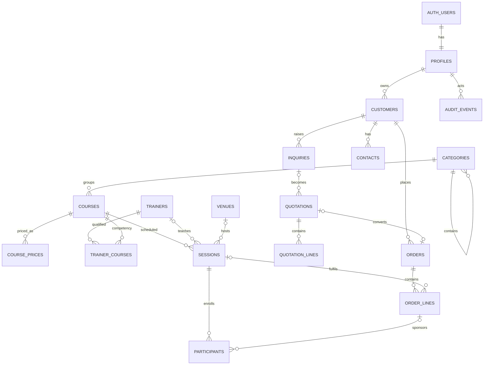

# Data model

## Target model

The approved target is 17 public business tables. `auth.users` remains owned by
Supabase and is not counted. Finance would add an eighteenth table only after the
product owner confirms scope. Reports, work queues, notifications, preferences,
and attention are queries over source records, not stored copies.

## Tables

| Table | Purpose and owner | Lifecycle/status | Key constraints and RLS |
|---|---|---|---|
| `profiles` | Identity, role, active state, optional team scope; Administrator-owned | Active/inactive | PK/FK Auth user; protected role; self safe-read, Admin manage |
| `audit_events` | Immutable material action trail; system-owned | Append-only | actor/action/entity/time/reason; Admin/Auditor read; no direct writes |
| `categories` | Two-level catalogue grouping; Operations | Active/inactive | unique sibling name; no cycles/depth > 2; authenticated read, Ops/Admin write |
| `courses` | Stable training definition; Operations | Active/inactive | unique uppercase code; positive duration/capacity; authenticated read, Ops/Admin write |
| `course_prices` | Current/historical standard fee by modality/currency; Operations | Active/inactive | nonnegative amount; one active key; authenticated read, Ops/Admin write |
| `trainers` | Scheduling resource; Operations | Active/inactive | stable record; safe read, Ops/Admin write |
| `trainer_courses` | Trainer competency; Operations | Active/inactive | unique trainer/course; qualification expiry optional |
| `venues` | Physical/virtual location; Operations | Active/inactive | physical capacity positive; safe read, Ops/Admin write |
| `sessions` | One course delivery interval; Operations | Draft/Confirmed/Running/Completed/Cancelled | end after start; confirmed conflict/qualification/capacity enforcement; safe read, Ops/Admin write |
| `participants` | Session roster/attendance; Operations | Active/Removed; Not recorded/Present/Absent | active email unique per session; soft removal; capacity and same-session order line |
| `customers` | Authoritative company record; Sales | Active/Archived/Merged | normalized identity search; own/team write; fulfilment-safe read |
| `contacts` | Customer people; Sales | Active/inactive | belongs to one customer; contact method required when used |
| `inquiries` | Training opportunity; Sales | New/Qualified/Quoted/Won/Lost | owner/customer required; loss reason for Lost; own/team write |
| `quotations` | Commercial offer header; Sales | Draft/Sent/Accepted/Declined/Expired | customer/owner/number; cannot send empty; terminal facts retained |
| `quotation_lines` | Course/quantity/price snapshot; Sales | Inherits quote | positive seats, nonnegative price; immutable outside Draft |
| `orders` | Commitment, owner, lifecycle, handoff facts; Sales then Operations | Draft/Ready for Handoff/With Operations/Fulfilment/Completed/Cancelled | unique number; atomic handoff facts; field-specific authority |
| `order_lines` | Purchased course/session/price snapshot | Active/Cancelled | positive seats/price; course matches session; capacity enforced |

Every mutable table uses UUID primary keys, `created_at timestamptz`, and
`updated_at timestamptz`. Money uses `numeric(14,2)` with ISO currency. Foreign
keys are indexed. Lifecycle values use concise check constraints. Deactivation,
archive, cancellation, soft removal, and audit replace destructive deletion.

## Relationships and invariants

1. Customer → inquiry → quote → order lineage is retained without requiring every step.
2. Quote/order lines retain course, description, modality, seats, currency, and price snapshots.
3. An order can contain multiple courses/sessions; a session can fulfil multiple order lines.
4. Responsibility is derived from handoff facts, not duplicated across assignments, tasks, and notifications.
5. Attention reasons derive from dates, missing data, conflicts, capacity, and responsibility.
6. Ordinary edits use `updated_at` for optimistic concurrency; handoff, conflict, capacity, and completion transactions lock/recheck.
7. No sensitive cost/rate fields are added until an approved workflow and column-level exposure design exist.

## Privileged function budget

| Function | Justification |
|---|---|
| `create_order(...)` | Atomically create header and validated lines, optionally from a quote |
| `send_order_to_operations(order_id)` | Lock, validate completeness/scope, stamp, audit |
| `accept_order(order_id)` | Lock and transfer responsibility atomically |
| `return_order(order_id, reason)` | Controlled regression with mandatory reason and audit |
| `complete_session(session_id)` | Recheck roster/attendance and make the session terminal |

Conflict lookup and completeness preview are ordinary RLS-safe queries. Trigger
functions that enforce timestamps/audit/category depth are database internals,
not application RPC endpoints.

## Existing entity decisions

This inventory covers major tables found in the base schema and later migrations.

| Existing entity | Decision | New destination/reason |
|---|---|---|
| `profiles` | Recreate | Smaller five-role identity and scope |
| `audit_log` | Recreate | `audit_events`, narrow immutable material changes |
| `approval` | Eliminate | Focused entity transactions, no approval engine |
| `assignment_log` | Merge | `audit_events` |
| `attribution` | Eliminate | No approved v1 workflow |
| `calendar_year` | Eliminate | Date filters, no rollover state |
| `client` | Recreate | `customers` |
| `organization` | Merge | `customers`, one company record |
| `contact` | Recreate | `contacts` nested in customer |
| `client_interaction` | Defer | Add only if next-action/notes prove insufficient |
| `conversion_rate` | Eliminate | No multi-currency reporting engine in v1 |
| `course` | Recreate | `courses` |
| `course_fee` | Recreate | `course_prices`, one standard-price model |
| `category` + `subcategory` | Merge | Self-referencing `categories` |
| `discount_rule` | Eliminate | No pricing rules engine |
| `duplicate_candidate` | Eliminate | Create-time normalized search; Admin repair |
| `normalization_lookup` | Eliminate | Explicit normalization functions/constraints |
| `import_exception` | Eliminate | Separate migration ETL rejects |
| `inquiry` | Recreate | `inquiries` |
| `quote` | Recreate | `quotations` |
| `quote_line` | Recreate | `quotation_lines` |
| `orders` | Recreate | `orders`, smaller lifecycle/handoff facts |
| `order_line` | Recreate | `order_lines` |
| `order_assignment` | Merge | `orders.sales_owner_id` + audit |
| `order_disposition` | Merge | Order lifecycle/cancellation facts |
| `order_handoff` | Merge | Endorse/accept/return facts on order + audit |
| `order_note` | Defer | One order notes field initially; table only if collaboration proves it |
| `participant` | Recreate | `participants` with soft removal/attendance |
| `salesperson` | Merge | `profiles` plus optional team scope |
| `schedule` | Recreate | `sessions` |
| `session_note` | Eliminate | Focused delivery notes on session |
| `trainer` | Recreate | `trainers` |
| `trainer_course` | Recreate | `trainer_courses` |
| `trainer_availability` | Defer | Conflict checking covers v1 evidence |
| `session_trainer` | Merge | One trainer on `sessions`; co-trainer deferred |
| `venue` | Recreate | `venues` |
| `webshop_product` | Eliminate | No web shop integration |
| `staging_calendar` | Eliminate | Separate ETL, not app schema |
| `staging_order_booking` | Eliminate | Separate ETL, not app schema |
| `schema_migrations` | Eliminate | Supabase migration history owns this concern |
| `invoice` | Eliminate | Avoid accounting/ERP scope |
| `payment` | Defer | Optional eighteenth table after owner decision |
| `refund` + `credit_note` | Eliminate | External finance authority; no mini-ledger |
| `attachment` | Defer | Storage need unproven |
| `message_template` + `comms_log` | Eliminate | No outbound communications platform |
| `sla_policy` | Eliminate | Dates derive My Work; no SLA engine |
| `feedback` + `complaint` | Defer | Outside launch workflow spine |
| `saved_view` | Eliminate | Fixed defaults, no personalization data |
| notification/task tables | Eliminate | My Work is derived from source facts |

## Delivered migration scope

`0001_initial_schema.sql` implements identity/audit and the first catalogue/
resource slice only: eight tables (`profiles`, `audit_events`, `categories`,
`courses`, `course_prices`, `trainers`, `trainer_courses`, `venues`). This is
intentional vertical delivery, not an incomplete attempt to pre-create all 17
tables. `0005_sales_handoff_workflow.sql` adds the seven approved commercial
tables (`customers`, `contacts`, `inquiries`, `quotations`, `quotation_lines`,
`orders`, `order_lines`) together with their UI workflow, RLS, atomic transitions,
and audit evidence. The delivered schema is now 15 tables; `sessions` and
`participants` remain the final two approved v1 business tables.
