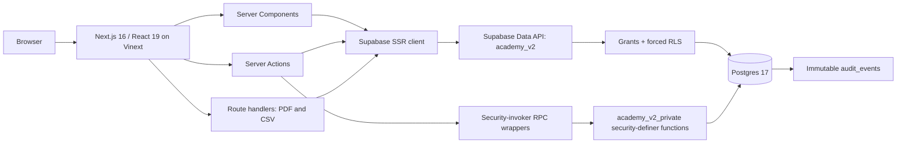

# Current system architecture

## v2.5 rollout update

The authoritative v2 business schema now has 21 tables. Four convergence aggregates were added without changing the modular-monolith boundary: `venue_rooms`, `trainer_unavailability`, `session_schedule_blocks` and `session_reservations`. Sessions now support public/private/internal offerings, publication and Go/No-Go state; quotation/order lines carry delivery intent and optional public-session selection. All multi-record capacity, conflict, handoff and lifecycle side effects remain centralized in database transactions.

## System map

## Runtime and deployment

| Concern | Current implementation | Assessment |
|---|---|---|
| Web framework | Next.js 16.3, React 19.2.8, TypeScript 5.9 | Appropriate modular monolith. |
| Runtime/build | Vinext/Vite, Cloudflare worker adapter, OpenAI Sites plugin | Keep; `.openai/hosting.json` defines the target hosting project. |
| Hosting data | No Sites D1 or R2 bindings | Correct: Supabase is the system of record; avoid a second database. |
| Auth | Supabase Auth with SSR cookies; `getClaims()` then profile lookup | Good boundary. Inactive/missing profiles fail closed. |
| Data access | Server components for reads, server actions for mutations, route handlers for files | Clearer than legacy client-wide hooks. |
| State | URL query parameters and server-rendered data; no global client store | Appropriate at current scale. |
| Database | Custom exposed `academy_v2` schema and unexposed `academy_v2_private` helpers | Strong isolation from the retained legacy `public` schema. |
| Deployment config | `.openai/hosting.json` contains project ID, no storage bindings | Keep. This assessment made no deployment change. |
| Environment | `NEXT_PUBLIC_SUPABASE_URL`, publishable key, public site URL | No server/service-role secret in application code. |

## Application boundaries

| Feature boundary | Main routes | Server modules | Database objects |
|---|---|---|---|
| Access/admin | `/login`, `/reset-password`, `/administration`, `/administration/role-preview` | `lib/auth`, `lib/permissions`, `features/access` | `profiles`, `audit_events` |
| Catalogue/resources | `/administration` | `features/training` | `categories`, `courses`, `course_prices`, `trainers`, `trainer_courses`, `venues` |
| Commercial CRM | `/sales`, quote/order details, `/customers` | `features/sales` | `customers`, `contacts`, `inquiries`, `quotations`, lines, `orders`, lines |
| Delivery | `/training`, session detail/import | `features/delivery`, `features/imports` | `sessions`, `participants` and delivery RPCs |
| Certificates/export | `/participants`, `/certificates`, PDF and CSV route handlers | `features/certificates`, `features/exports` | participant certificate fields, scoped list RPC |
| Work/reporting | `/my-work`, `/overview` | `features/workspaces`, `features/reporting` | RLS-filtered reads and `audit_events` |

## Database architecture

The live `academy_v2` schema contains 17 tables, all with RLS enabled and forced. Anonymous table/RPC access is revoked. Public RPCs are `SECURITY INVOKER` wrappers; privileged logic lives in the unexposed `academy_v2_private` schema with an empty search path and role checks.

The live v2 advisor result on 2026-08-31 was:

- security: **0 findings** for `academy_v2`;
- performance: 36 `unused_index` informational findings, expected on demo-scale data (one session, six participants) and not evidence that indexes should be removed;
- no v2 unindexed-FK, missing-policy, mutable-search-path, or exposed security-definer finding.

The legacy `public` schema remains in the same project for reference/continuity. It has 52 tables, 30 views, and 44 security advisor findings: one policy-info item and 43 authenticated callers able to execute public security-definer functions. Those findings belong to the legacy surface and reinforce the schema-isolation strategy.

## Authentication and authorization

1. Request middleware refreshes Supabase cookies.
2. Server code gets signed claims using `getClaims()`.
3. `academy_v2.profiles` supplies application role, active status and supervisor scope.
4. Page/action helpers provide user-friendly gating.
5. Explicit Postgres grants and RLS are authoritative.
6. Database functions re-check role, ownership, current state and related records inside the transaction.

The five roles are `administrator`, `operations`, `sales`, `manager`, and `auditor`. Sales Supervisor is an attribute constrained to the Sales role. This is a deliberate simplification of eight legacy roles.

## Business-rule placement

| Rule type | Placement | Example |
|---|---|---|
| Format/usability validation | Shared TypeScript parsers/actions | course code, required contact channel, numeric bounds |
| Invariants | Constraints, unique indexes, FKs | valid statuses, unique certificate number, parent depth |
| Authorization/visibility | Grants + RLS + private helpers | owner/team inquiry scope, Operations delivery scope |
| Multi-record transitions | Database functions | quote conversion, order handoff, session transition, waitlist promotion |
| Conflict prevention | Database transaction and time-range checks | trainer/venue overlap and capacity |
| Presentation-only derivation | Feature functions | seat summary, overdue inquiries, report grouping |

## Current state management and data loading

Reads are broad `Promise.all` queries within each workspace and then joined/derived in memory. This is simple and acceptable for the demo dataset, but list routes are not truly paginated. Before production-scale import, server-side filtered/paginated queries are required for participants, customers, audit events, sessions, and commercial records.

## Error handling

- Expected validation errors redirect with concise query-string notices.
- Known database codes are mapped to safe user messages.
- Delivery actions expose database business-rule messages for known integrity errors.
- Unexpected database details are not shown to end users.
- Root error boundary exists, but there is no structured observability/trace correlation documented.

## Tests

- 29 TypeScript test assertions across nine files: permissions, catalogue validation, sales math/status helpers, delivery helpers, work queues, reporting, participant CSV, certificate PDF model, and CSV exports.
- Two SQL smoke files cover anonymous denial, no-profile denial, helper privileges, Sales/Supervisor/Operations scope, and protected order transition reachability.
- Playwright is configured, but the repository has no `e2e/` test directory. Authenticated workflow, mobile, file, and concurrency E2E coverage is therefore absent.
- Baseline verification on 2026-08-31: TypeScript passed, all 29 Vitest tests passed, and the Vinext production build passed. The combined quality gate stopped at lint because three existing export links use raw `<a>` navigation where the current Next lint rule requires `Link`.

## Technical debt and risks

1. Mobile primary navigation disappears below 980px.
2. No dedicated audit route despite an auditor role and audit table.
3. Workspace queries load complete permitted sets; no cursor/keyset pagination.
4. No authenticated E2E harness.
5. Batch certificate issuance loops across RPC calls, so a partial batch is possible.
6. Sessions use a single continuous time range; multi-day/split delivery semantics are unclear.
7. Trainer records only contain a name and active flag; contact, availability, evidence and employment type are absent.
8. Venues are flat; rooms, equipment and hybrid configuration are absent.
9. Audit coverage exists for material workflow actions but not every catalogue/customer edit.
10. Client and database validation are complementary but not generated from a single contract.
11. The lint gate currently fails at `src/app/certificates/page.tsx`, `src/app/participants/page.tsx`, and `src/app/training/page.tsx` for internal export anchors.

## Architecture decision

Keep the modular monolith, feature folders, server-side data access, custom v2 schema, explicit RLS, and transactional RPC approach. Add domain objects only when a verified workflow requires them. Do not reintroduce the legacy global data hook, duplicate status models, or a large public security-definer RPC surface.
