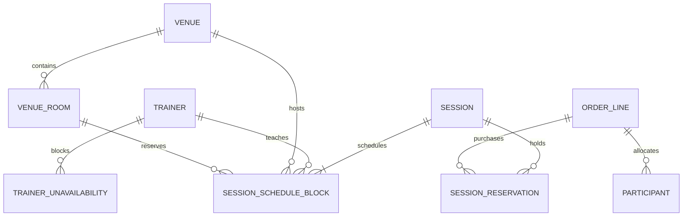
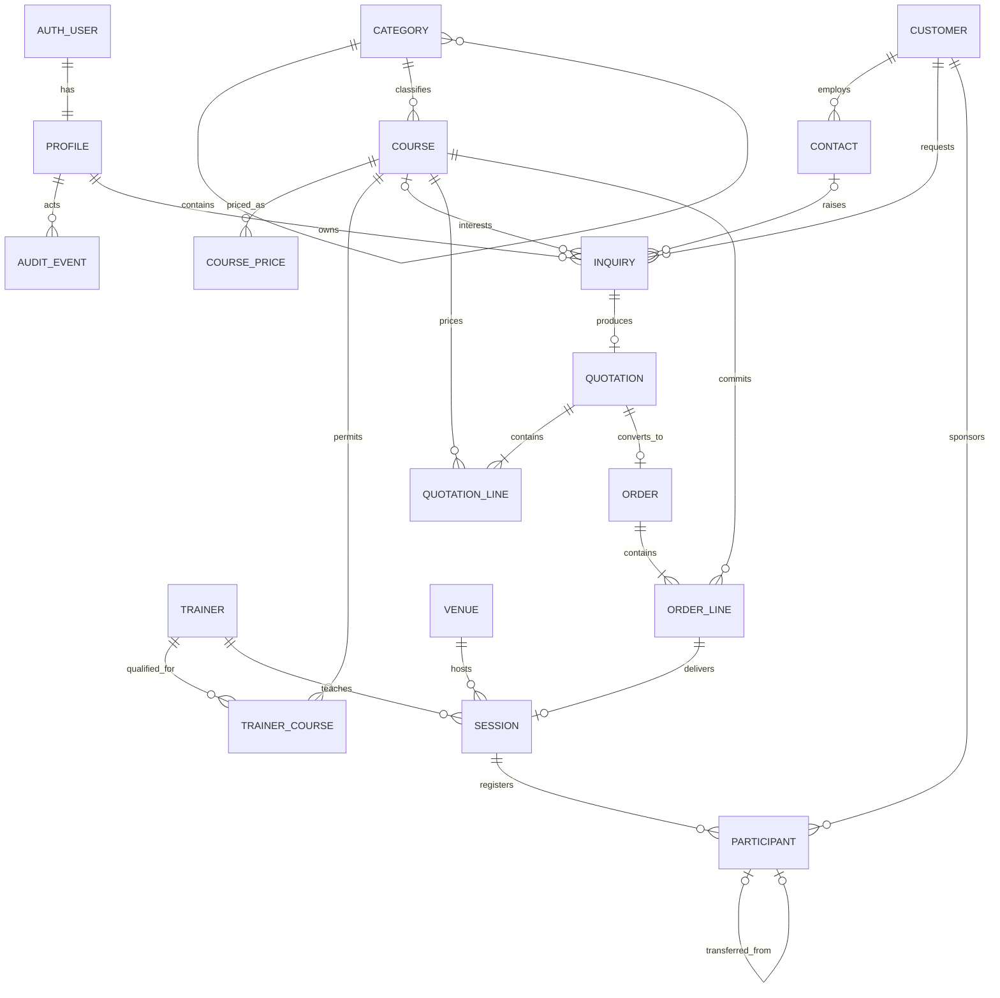

# Domain and entity model

## v2.5 model additions

`SESSION` is the delivery aggregate. Its envelope (`starts_at`/`ends_at`) supports summaries; `SESSION_SCHEDULE_BLOCK` is the conflict-authoritative dated schedule. `SESSION_RESERVATION` is the commercial seat commitment, while `PARTICIPANT.order_line_id` optionally allocates a named attendee against that commitment so capacity is not double counted.

## Target core model

## Current entities

| Entity | Identifier and important attributes | Relationships/cardinality | Lifecycle/delete/audit |
|---|---|---|---|
| Profile | Auth UUID; name, five-value role, active, Sales Supervisor flag | 1:1 Auth user; owns commercial/delivery records; audit actor | Inactive by default; admin updates audited; Auth deletion cascades profile but owned FKs generally protect evidence. |
| Audit event | Identity bigint; actor, action, entity type/id, reason, JSON details, occurred time | Many per actor/entity | Immutable; actor becomes null if profile removed; no delete grant. |
| Category | UUID; parent, name, active | Max two levels; 1:M courses | Deactivate, restrict referenced deletion; depth trigger and sibling uniqueness. |
| Course | UUID; unique code, title, duration, default capacity, active | M:1 category; 1:M prices/qualifications/lines/sessions | Deactivate; references restrict; catalogue changes should be audited in next slice. |
| Course price | UUID; learning type, amount, currency, effective date, active | M:1 course | One active price per course/type/currency; retain history. |
| Trainer | UUID; name, active | M:M courses; 1:M current sessions | Resource, not user; deactivate; scheduled history retained. |
| Trainer qualification | UUID; trainer, course, qualified-until, active | Join with unique trainer/course | Deactivate; expiry checked at scheduling. |
| Venue | UUID; name, physical/virtual, capacity/address, active | 1:M sessions | Deactivate; physical requires positive capacity, virtual has null capacity. |
| Customer | UUID; normalized name/domain, industry/address, active/archived | 1:M contacts/inquiries/orders/participants | Archive; normalized unique protection; created-by recorded. |
| Contact | UUID; name/title/email/phone/active | M:1 customer; optional reference from commercial records | At least one channel; deactivate; composite customer reference prevents cross-customer contact. |
| Inquiry | UUID + sequence number; customer/contact/course/owner; status, requirement, estimate, next action/date | M:1 customer/owner; 0:1 quote | New→Qualified→Quoted→Won/Lost; owner/RLS scoped. |
| Quotation | UUID + number; inquiry/customer/contact/owner; status, discount and approval evidence | 1:M lines; 0:1 order | Draft→Sent→Accepted/Declined/Expired; approval resets when discount changes. |
| Quotation line | UUID; course/type/pax/unit price/currency | M:1 quote/course | Draft-only insert/update/delete; copied into order atomically. |
| Order | UUID + number; quote/inquiry/customer/contact, Sales/Ops owners, status, handoff metadata | 1:M lines; 1:M sessions through lines | Draft→Pending Ops→Returned/With Ops→Fulfillment→Completed/Cancelled; transitions audited. |
| Order line | UUID; course/type/pax/price/currency snapshot | M:1 order/course; currently 0:1 session | Immutable commercial snapshot after conversion; current unique course/type per order. |
| Session | UUID + number; order/line/course/type/trainer/venue/Ops owner, status, time range/timezone/capacity/notes/cancel reason | M:1 order line/trainer/venue; 1:M participants | Scheduled→Open→In progress→Completed/Cancelled; one session per order line is a current limitation. |
| Participant | UUID + number; session/customer, contact fields, registration/outcome/certificate states, transfer link | M:1 session/customer; self-reference for transfer | Register/waitlist/confirm/cancel/transfer/complete/no-show; certificate evidence never silently deleted. |

## Candidate additions, only when confirmed

| Candidate | Business need | Proposed shape | Priority/decision |
|---|---|---|---|
| Trainer availability exception | Planned unavailability not represented by assignments | `trainer_availability_exceptions(id, trainer_id, starts_at, ends_at, kind, note, created_by, timestamps)` with exclusion/overlap indexes | P0 |
| Session schedule block | Split/multi-day dates and correct daily conflicts | `session_schedule_blocks(id, session_id, starts_at, ends_at, trainer_assignment/room optional)`; session becomes commercial/delivery aggregate | P0 decision |
| Session trainer assignment | Co-trainer/facilitator roles | `session_trainers(session_id, trainer_id, role, timestamps)` | P1, only with evidence |
| Venue room | Multiple rooms/equipment at a venue | `venue_rooms(id, venue_id, name, capacity, equipment jsonb or normalized later, active)` | P1 |
| Activity | Calls/meetings/notes and next action history | `activities(id, subject_type/id, kind, occurred/due, owner, outcome, note)` with scoped access | P1 |
| Import job | Auditable bounded bulk operations | job, file hash, counts, status, row errors; storage only after retention rules | P1 |

## Concepts intentionally consolidated

- Legacy `client` and `organization` become Customer. Contact stays distinct.
- Legacy category and subcategory become a two-level Category tree.
- Legacy Sales Manager becomes a Sales scope flag until multiple teams require membership tables.
- Lead and opportunity remain one Inquiry lifecycle until forecasting requires materially different fields/cardinality.
- Attendance, assessment and certificate stay on Participant because current rules are one outcome per participant per session. Split only if multiple attendance dates/attempts are introduced.
- Generic approvals are avoided; quotation discount approval is modeled directly. Add focused cancellation/refund approval only when required.

## Ownership and audit rules

- `created_by` records provenance; owner fields control work responsibility and RLS.
- Commercial ownership changes and handoffs must be explicit transitions, never direct client updates.
- Referential deletes default to `RESTRICT`; identity/audit actor references may use `SET NULL`; Auth-to-profile may cascade.
- Business records use active/archive/status, not destructive delete.
- Material transitions, role/scope changes, assignments, schedule changes, participant moves/outcomes, certificate issue/revoke and override reasons are audit events.
- Derived numbers (seat availability, totals, utilization, overdue state) are calculated from authoritative rows, not stored without a reconciliation need.
