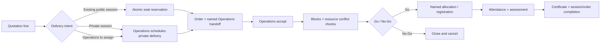
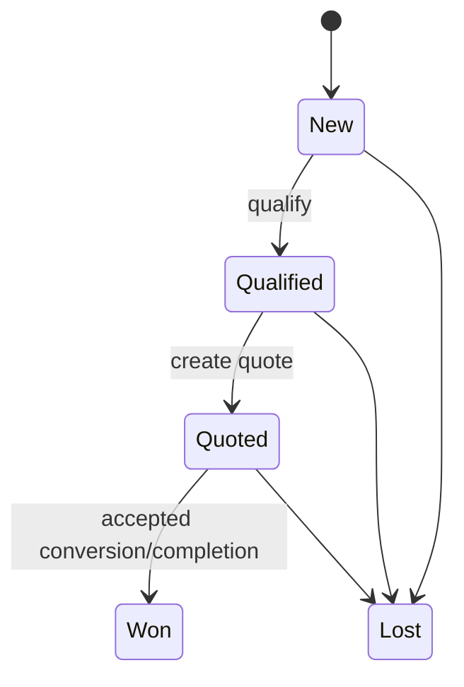
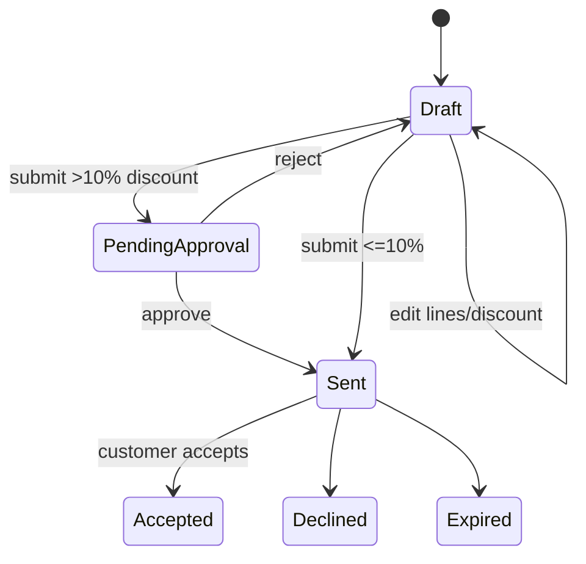
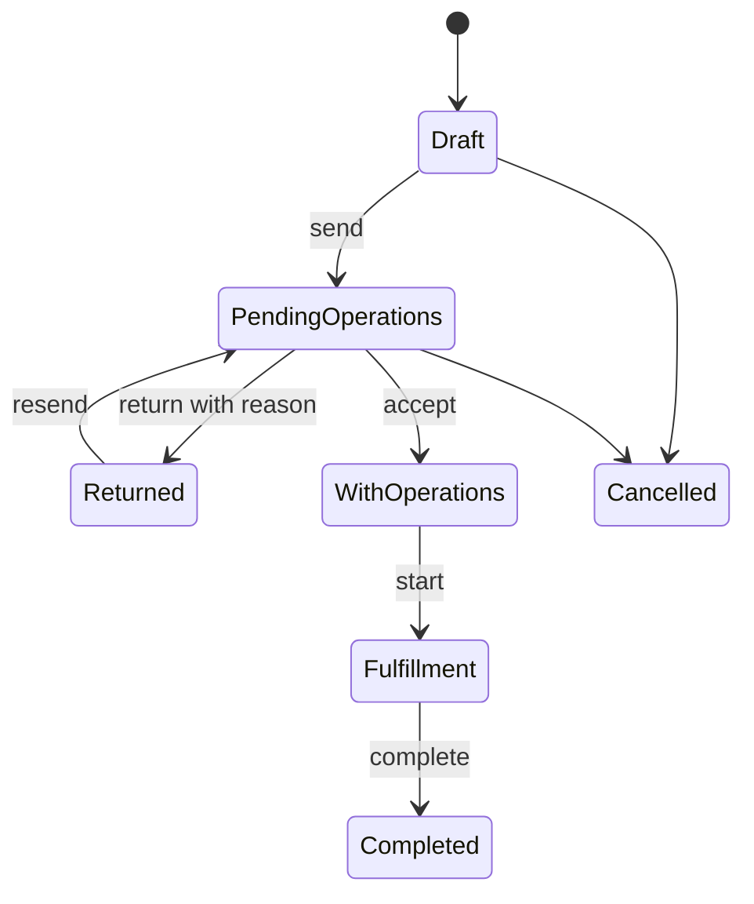
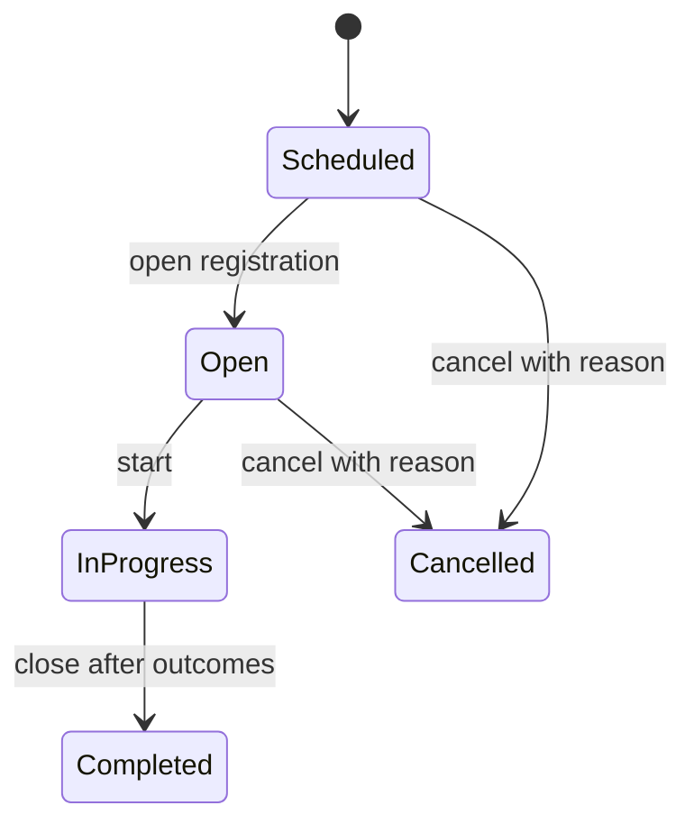
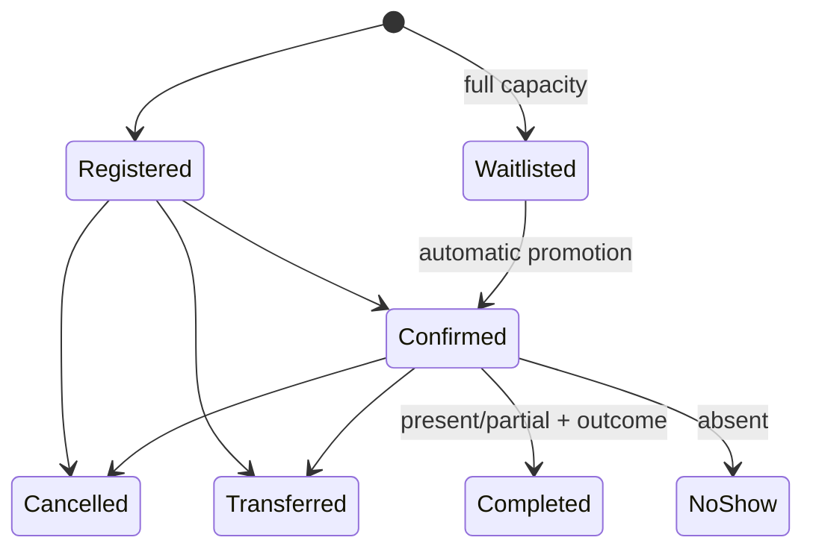

# Workflow and state-machine map

## v2.5 integrated workflow

Order cancellation now cancels active named allocations, releases commercial reservations, rebalances capacity and promotes eligible waitlist records in the same transaction.

## End-to-end value stream

```mermaid
flowchart LR
  A[Customer + contact] --> B[Inquiry]
  B --> C[Qualify]
  C --> D[Quotation + lines]
  D --> E{Exceptional discount?}
  E -- yes --> F[Supervisor approval]
  E -- no --> G[Issue quote]
  F --> G
  G --> H[Customer accepts]
  H --> I[Convert to order]
  I --> J[Prepare delivery facts]
  J --> K[Send to Operations]
  K --> L{Ops review}
  L -- return --> J
  L -- accept --> M[Create session]
  M --> N[Assign qualified trainer + venue]
  N --> O[Register / import roster]
  O --> P[Capacity + waitlist]
  P --> Q[Open / start session]
  Q --> R[Attendance + assessment]
  R --> S[Complete session]
  S --> T[Issue certificates]
  T --> U[Customer history + follow-up]
```

## Current target workflows

### Commercial flow

1. Sales creates/searches a customer, adds a contact, and records an inquiry with owner, need, estimated participants and next follow-up.
2. A New inquiry can be Qualified. Quotation creation copies customer/contact/owner context and marks the inquiry Quoted.
3. Draft quotation lines snapshot course, modality, participant count and unit price. A discount over 10% requires Sales Supervisor/Administrator approval.
4. Discount edits reset prior approval evidence. A quote cannot be sent until it has lines and any required approval.
5. Accepted quotation conversion atomically creates one order and its lines; repeated conversion is rejected.
6. Sales adds requested start date and delivery notes, then sends the order to Operations.
7. Operations accepts or returns with a reason. Acceptance assigns Operations ownership. Fulfillment starts/completes through database transitions.

### Delivery flow

1. Operations chooses an accepted order line that has no session.
2. It chooses a qualified active trainer, active venue, interval, capacity and notes.
3. Database transaction checks end-after-start, trainer qualification/expiry, trainer overlap, venue overlap, physical capacity and order eligibility.
4. Session is created as Scheduled/Open depending the requested transition; all changes are audited.
5. Reschedule repeats the same checks under lock and preserves an audit record.
6. Participant registration auto-waitlists when active seats reach capacity.
7. Confirmation/cancellation and transfer run transactionally; a released seat promotes the oldest eligible waitlist entry.
8. Attendance and assessment require an in-progress/completed session and consistent minutes/result rules.
9. Session completion requires no incomplete participant outcomes.
10. Certificate issuance requires completed session + eligible participant. Only Administrator can revoke, with reason.

## State machines

### Inquiry

Current UI implements New→Qualified→Quoted. Won/Lost transitions need a dedicated action and lost reason before the lifecycle is complete.

### Quotation

Editing discount after approval clears approval actor/time. Conversion is allowed once and only from Accepted.

### Order/handoff

Cancellation exists in the schema but lacks a completed current action/policy. Do not permit direct status edits.

### Session

Reversal rules: rescheduling is allowed before completion/cancellation; completed/cancelled records are evidence and should not reopen without a privileged correction workflow.

### Participant and certificate

Certificate: Not Eligible → Eligible after valid outcome → Issued after session completion → Revoked by Administrator with reason. Re-issuance after revocation requires an explicit future correction policy.

## Legacy workflows not copied directly

- Two overlapping order state models are replaced by one handoff/fulfillment state machine.
- Generic approval records are replaced by focused workflow evidence until more approval types are confirmed.
- Generic task tables are not required for facts derivable from domain state; a typed activity/due-date record may be added for human follow-ups.
- Finance ledger mutations remain outside this portal; SAP integration should be reference/read-only unless governance changes.

## Open workflow decisions

1. Does one order line create exactly one session, or can it produce a series/cohort of sessions?
2. Does one multi-day training use daily schedule blocks, and can trainer/venue vary per block?
3. Who approves cancellation/no-go, and at what thresholds?
4. When an inquiry is Lost, which reason taxonomy and reporting date are required?
5. Is Sales allowed to register participants before Operations accepts the handoff?
6. Does partial attendance use a course-specific completion threshold?
