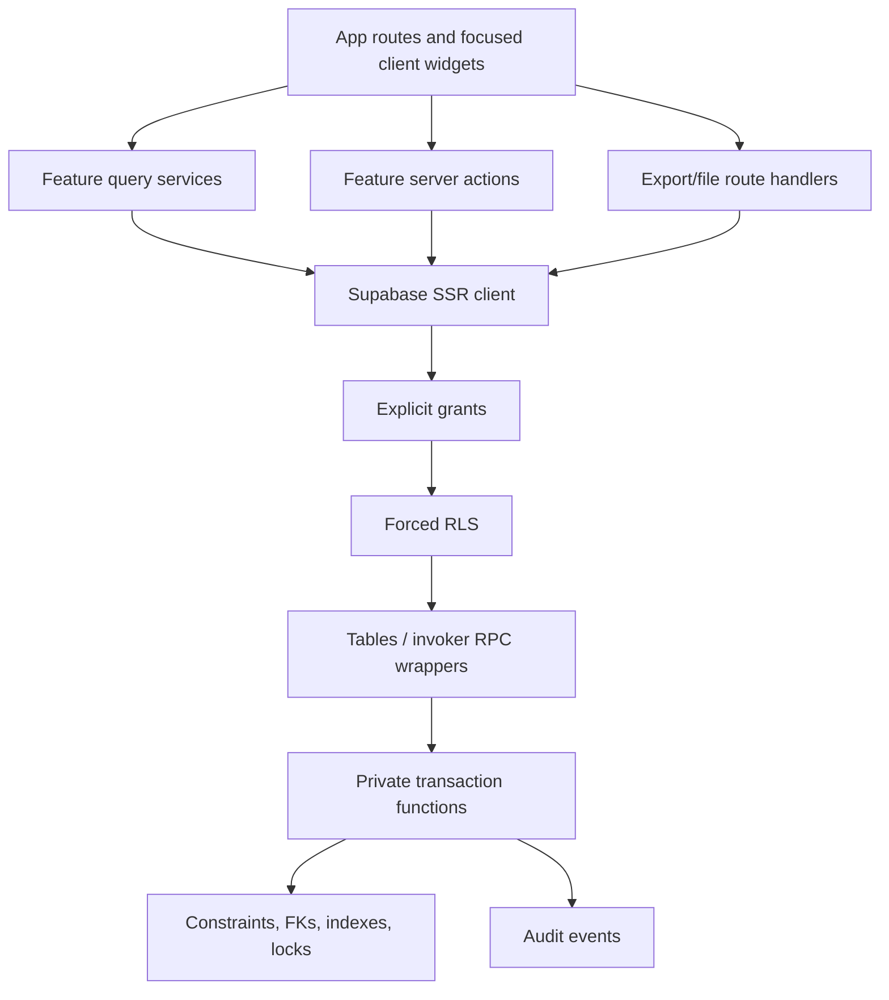

# Target architecture

## Implemented convergence

The target architecture has now absorbed the v1 outcomes selected for the v2.5 rollout. The four added tables are focused aggregates rather than a return to legacy breadth. Resource scheduling uses transaction-level advisory locks plus row locks; commercial capacity uses a separate reservation aggregate; public/private/internal delivery shares one session state machine. This preserves the principles below.

## Principles

1. One deployable modular monolith.
2. Supabase/Postgres is the authoritative data and policy layer.
3. `academy_v2` is the only application Data API schema; privileged helpers stay unexposed.
4. Server components read; server actions/route handlers orchestrate; database transactions enforce multi-record rules.
5. Roles are coarse responsibility groups; scopes/capabilities handle exceptions.
6. Status transitions are named commands, not arbitrary row updates.
7. Archive and immutable evidence replace destructive business deletes.
8. Lists share a query/interaction contract, not one giant table component.
9. Derive queues and metrics from domain state; store tasks only for genuinely human work.
10. Communication automation remains a separate, opt-in boundary.

## Component model



## Feature folder contract

Each feature may contain:

- `types.ts`: domain-facing types, no database authority assumptions;
- `validation.ts`: input normalization and fast feedback;
- `queries.ts`: bounded, filtered server reads;
- `actions.ts`: authentication, capability check, RPC/table command, safe error mapping and revalidation;
- `rules.ts`: pure presentation/decision helpers only;
- focused UI components and tests.

Cross-feature business rules belong in database functions or a small domain module, not page components.

## Database design

- Keep 17 current tables as the core.
- Add `trainer_availability_exceptions` first.
- Add `session_schedule_blocks` only after the parent/block semantics are confirmed.
- Add room, activity, import-job or attachment tables only with verified workflows.
- Index every foreign key used for joins/deletes and every RLS ownership predicate.
- Use partial unique indexes for active/effective records.
- Use keyset pagination on `occurred_at,id`, `created_at,id`, or business sequence numbers for large lists.
- Keep security-definer functions in `academy_v2_private`, `search_path=''`, schema-qualified, minimally granted, with public invoker wrappers only when Data API access is required.

## Authorization design

```text
Supabase Auth identity
  -> active Profile role/scope
  -> server capability check for UX
  -> explicit table/function privilege
  -> forced RLS ownership/role predicate
  -> transaction-level state and relationship validation
  -> audit event
```

Future capabilities should be named business actions (`schedule_session`, `approve_discount`, `view_audit`) rather than route names. A role maps to capabilities in one module; the database mirrors the same intent with focused helpers/policies.

## List and search architecture

All operational listings should support a common contract:

```ts
type ListQuery = {
  search?: string
  filters: Record<string, string | string[]>
  sort: { field: string; direction: 'asc' | 'desc' }
  cursor?: string
  pageSize: 25 | 50 | 100
}
```

Pages render semantic tables on desktop and priority-field cards/rows on small screens. Filters live in the URL. Bulk actions are added only where a single transaction and auditable all-or-nothing rule exist.

## Scheduling architecture

Scheduling must be a single database command that:

1. locks the session and candidate resource rows;
2. validates status, course qualification and availability;
3. checks trainer, room/venue and capacity overlaps;
4. writes the session/block assignment;
5. records an audit event;
6. returns a domain-safe conflict message.

The UI may preview conflicts, but the database is the race-safe authority. Drag/drop, recurrence and bulk rescheduling must call the same command.

## Audit architecture

- Append-only `audit_events` for material changes.
- Standard action names: `entity.created`, `entity.updated`, `entity.status_changed`, `entity.assigned`, `entity.archived`, `entity.restored`, `entity.exported`.
- Details contain field names/IDs and safe before/after values; do not duplicate participant contact secrets.
- Administrator/Auditor read with paginated filters; no direct update/delete.
- Sensitive exports and overrides require reason and produce their own audit event.

## Files and communications

File storage is not added until access, retention, malware scanning, signed URL lifetime and deletion/legal hold rules are approved. Communication automation remains outside this target slice; future jobs must be idempotent, consent-aware, previewable and logged.

## Observability and operations

- Structured server logs with request correlation ID and safe error category.
- Database errors mapped to user messages while preserving detailed server diagnostics.
- Health check for app↔Supabase connectivity.
- CI gates: lint, typecheck, unit, SQL integration, authenticated E2E, build.
- Migrations are append-only and applied through the normal migration mechanism; live console edits are not the source of truth.
